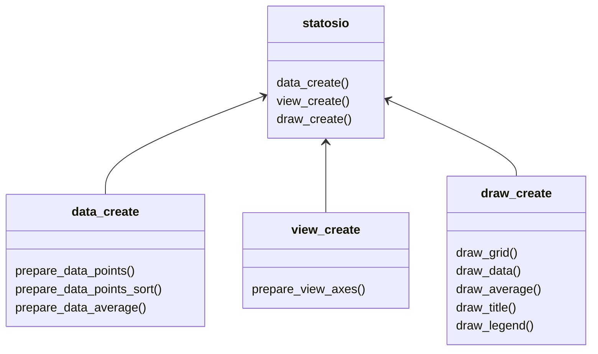

# Function Tree

```mermaid
    classDiagram
        statosio <-- data_create
        statosio <-- view_create
        statosio <-- draw_create

        class statosio{
            data_create()
            view_create()
            draw_create()
        }

        class data_create{
            prepare_data_points()
            prepare_data_points_sort()
            prepare_data_average()
        }
        class view_create{
            prepare_view_axes()
        }
        class draw_create{
            draw_grid()
            draw_data()
            draw_average()
            draw_title()
            draw_legend()
        }
```